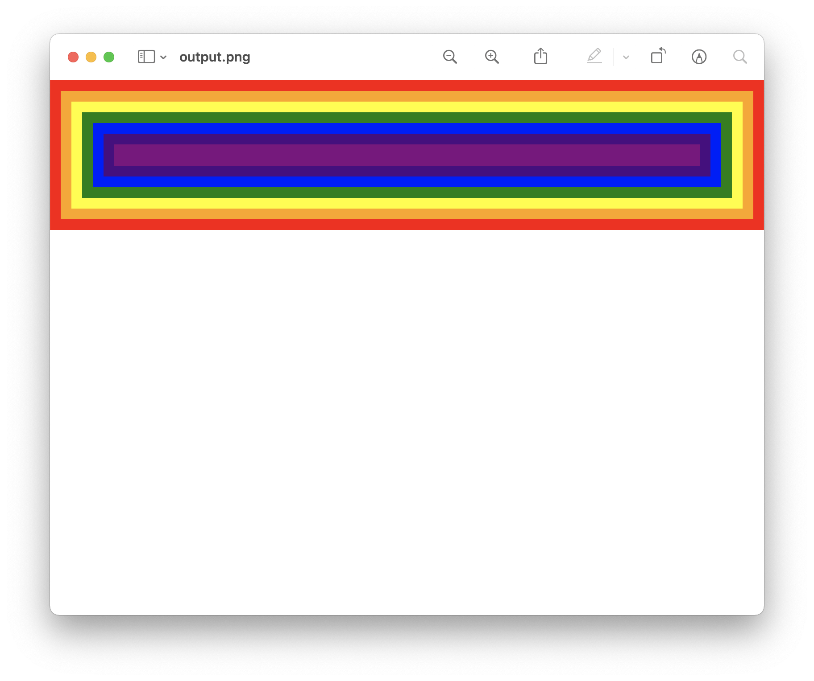

# rust-browser

A toy browser engine implementation with Rust.



Following the tutorial:

- https://limpet.net/mbrubeck/2014/08/08/toy-layout-engine-1.html
- https://github.com/mbrubeck/robinson

## Start

```sh
git clone git@github.com:inokawa/rust-browser.git
cd rust-browser
cargo run
```
